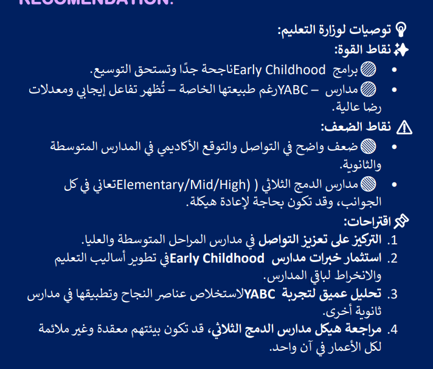

# 🎓 School Data Analysis – General Education Insights

## 📌 Overview

This project presents an **exploratory data analysis (EDA)** of public general education school data. The aim is to identify trends, compare performance, and visualize key metrics that can help understand the current educational landscape.

---

## 🗂 Project Files

- **`General_Education_School.csv`**: The main dataset containing information about schools, types, regions, student numbers, etc.
- **`School_anlaysis.ipynb`**: A Jupyter Notebook containing the full data analysis, preprocessing, and visualizations.
- **`School_analysis.pdf`**: The final report summarizing the findings, interpretations, and recommendations.
- **`image.png`**: One of the visualizations used in the report/notebook.

---

## 🔍 Key Analysis Topics

- Distribution of school types and student numbers
- Regional differences in school counts or resources
- Visual trends based on available attributes
- Recommendations based on insights

---

## 🧰 Tools Used

- Python (Pandas, Matplotlib, Seaborn)
- Jupyter Notebook
- Microsoft Word / PDF for reporting

---

## 📊 Example Visualization

---

## 📎 Dataset Description

- Format: CSV
- Columns: [e.g. school_name, region, type, total_students, ...]
- Size: [Add number of rows/columns if known]
- Note: Data used for educational purposes only.

---

## 📑 Report Contents

The report (`School_analysis.pdf`) includes:

- Description of the dataset
- Data preprocessing
- Exploratory visualizations
- Insights & recommendations

---

## 👩‍💻 Author

- **Name**: Hiba  
- **Role**: Data Analyst / Trainee  

---

## 🛡 License

Educational use only. Dataset and analysis are part of a training task.

